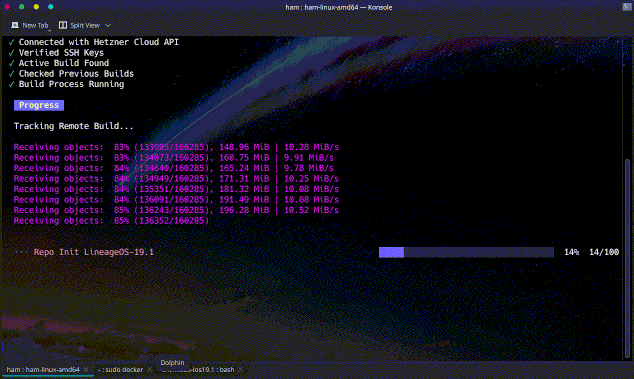

     

# HAM     

HAM (Hetzner Android Make) is a Simple tool written in GO which can build LineageOS (or AOSP) from Source using Hetzner Cloud. 
**Build your Own Flavor of Android Under €1.** (Run Directly from your Android Phone too..)

     

# Getting Started

Follow the [official documentation](https://antony-jr.github.io/ham/docs/get_started) to get started.

# Disclaimer

**This project has no association with "Hetzner Online GmbH" in any form or manner, This project is purely Community work
and have no relationship with the company. This project purely exists for the community and will live if there is more contributions.**

# Hetzner Referral Program

Hetzner Online Gmbh has a referral program for loyal customers, if you signup using my referral link you will get free
20 euros cloud credit which you can build a ton of LineageOS builds for any device you like. The only problem is that 
Hetzner is pretty hard to register with but it is worth it. **I don't force you to use my referral link, it's totally upto
you.** [Hetzner Referral Link](https://hetzner.cloud/?ref=66oUbG2e4jXS)

Consider using the referral link as support towards this project. You can also star this repository to increase the
credibility of this project.

# License

The BSD 3-Clause "New" or "Revised" License.

Copyright (C) 2022-present, D. Antony J.R.

